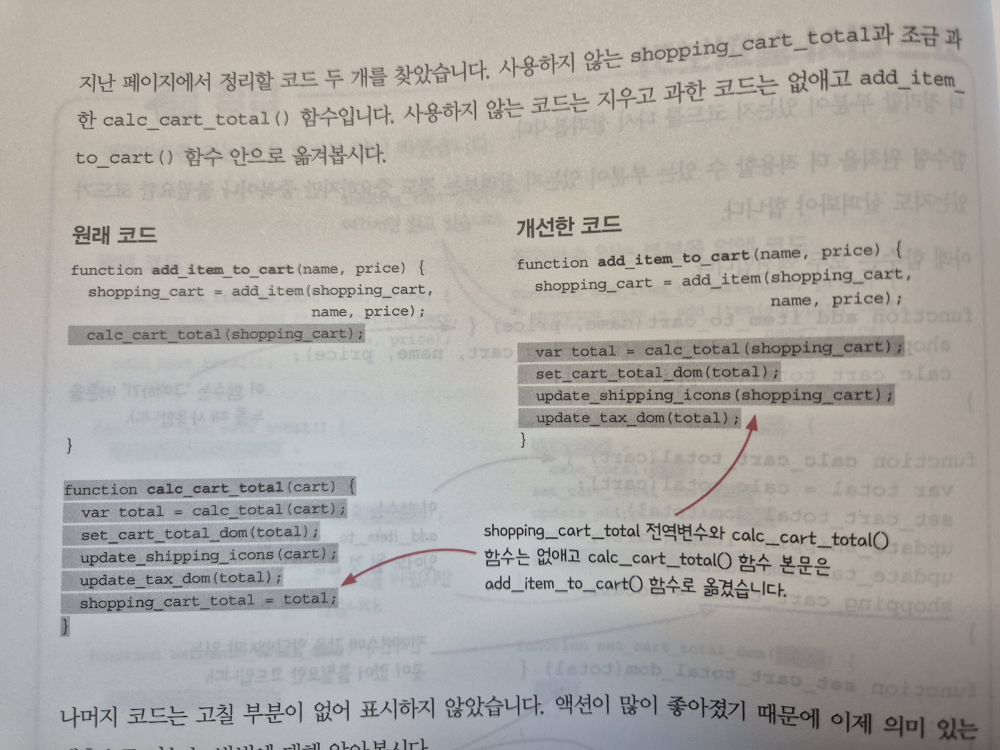

### 굼금즘

1. 96p 단순 궁금증.

여러분이 봤을 때 개선한 코드가 보기 좋아 보이는지

원래 코드가 보기 좋아보이는지 궁금합니다

함수명만 봤을 때는 장바구니에 아이템만 넣지 않는가?
(add_item_to_cart) 그래서 total이 들어가는게 맞는지 궁금

2. 163p 연습문제

Q. 안전지대 안에서 불변성을 유지하기 위해 쓴다

A. CW(카피-온-라이트)

근데 이 부분에서 DC(방어적 복사)는 왜 답이 아닌지 궁금하다

신뢰할 수 없는 코드와 데이터를 주고받을 때

안전지대 관점에서도 불변성을 유지하기 위해서 깊은 복사를 할텐데

생각하기로는 신뢰할 수 없는 코드로 데이터를 전달했을 때

그 이후는 변경될 수 있기에 단순히 안전지대 안에서`만` 하지 않아서일까요?