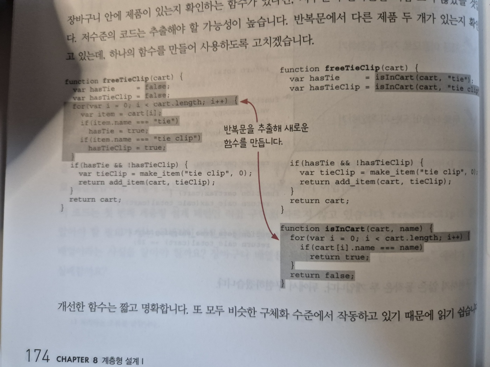

### 궁금한 점들

### 1. 한 번의 반복문과 함수 추출로 인한 2번의 반복문

- (174p) 함수로 추출했을 때 오히려 2번 반복문을 돌기 때문에
성능면에서는 안 좋지 않을까 라는 생각이 들면서 의견을 물으려고 했습니다

하지만, 언제나 트레이드오프, 정하기 나름이라고 생각되어지고 불필요한 질문 같아 pass합니다.

대신에 책에서 봤던 내용 중 와닿는게 있어 적습니다

책에서처럼 좋은 설계를 위해서는 `지속적인 탐구와 직관`이 필요하다고 말하는 것처럼 코드에 대한 관심을 꾸준히 갖는게 좋은 습관 같습니다.

### 2. 오탈자 찾기

- (183p) freeTieClip함수에는 setPriceByName함수에 대한 접근이 없지만
화살표가 존재합니다.

### 3. 각 설계에 대한 의견

- 서로 다른 추상화 단계에 있는 기능을 사용하면 `직접 구현 패턴`이 아니기 때문에 오른쪽에 있는 설계가 더 좋을 수는 있을 것 같습니다.

하지만, 직접 참조의 경우 나와있는 것처럼 편리하고 오히려 이해하기 쉽다고 보입니다.

이외에 내용들을 보시면서 다른 느낌들이 있었다면 뭐였는지 궁금합니다.