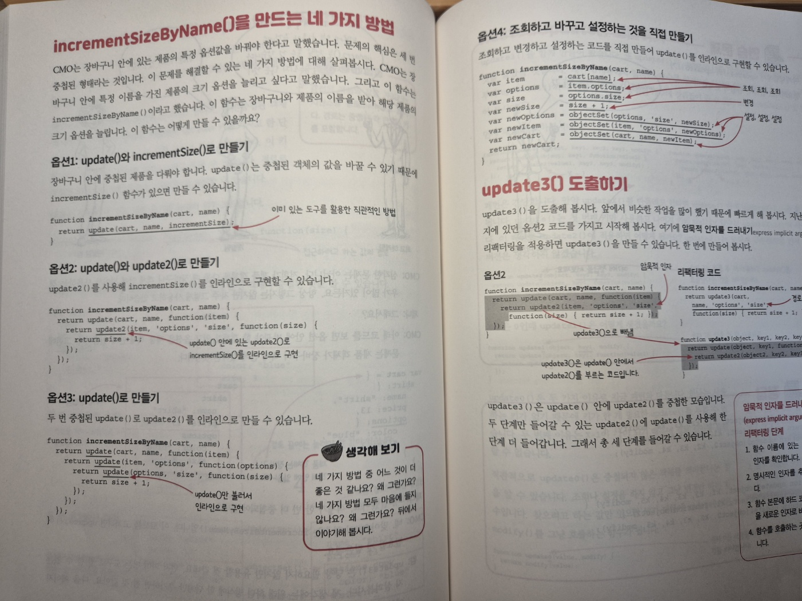

### [ 전체적인 간략 정리 ]

1. 돌고돌아 함수의 `암묵적 인자를 드러내고(가장 중심)` `함수 본문을 콜백`으로 바꾸기가 반복 중요하다. (코드 냄새를 잘 맡아보자)

2. 중첩되는 데이터가 존재한다면 이를 `작은 단계로 단순화`하고 나누어서 알아보기 쉽게 만들도록 하는 것이 중요하다. 

### 간략 궁금한 점들

1. reduce()를 잘 안쓰고 조금 이해하는데 어려운 것 같은데, 많이들 사용 하시는지 궁금하다 

2. 옵션3, 옵션4의 경우가 좀 비교될 것 같은데, 
옵션 3의 경우는 함수 하나에 반복적인 로직 수행
옵션 4의 경우는 하나의 함수로 여러 번 호출

위의 2가지 경우로 생각했을 때 어떤 스타일을 더 선호하는지 궁금하다 

저는 옵션 4가 호출을 여러 번해도 
내가 알아보기 쉬운가를 봤을 때 더 알맞다고 생각합니다. 

