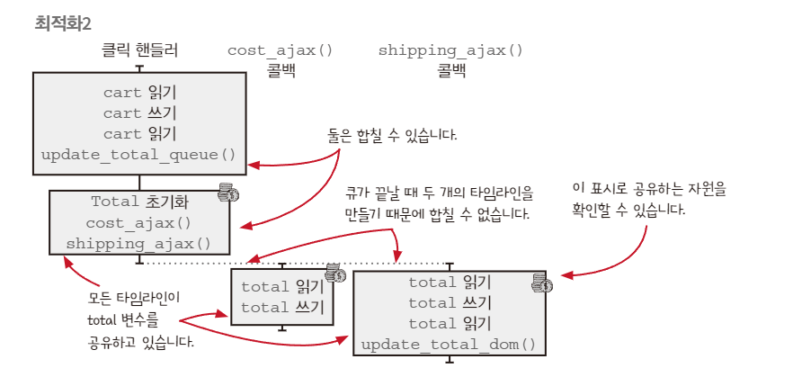

### 전체적인 진짜 간략 정리...

### 타임라인 격리하기

- 소프트웨어가 어떻게 동작하는지 이해하는 데 도움이 된다.

- 그래서 타임라인 그릴 때 고려할 것들이 존재한다

### 좋은 타임라인의 원칙

1. 타임라인은 적을수록 이해하기 쉽다
2. 타임라인은 짧을수록 이해하기 쉽다
3. 공유하는 자원이 적을수록 이해하기 쉽다
4. 자원을 공유한다면 서로 조율해야 한다
5. 시간을 일급으로 다룬다 
    1. 함수형 프로그래밍으로 문제에 맞는 `새로운 시간 모델` 을 만든다

### 예시

1. 모든 액션들을 확인한다.
2. 모든 액션을 그린다
3. 다이어그램을 단순화한다.
4. 타임라인에 있는 모든 액션을 통합하고 할 것이 있는지 포함하여 최적화한다.
