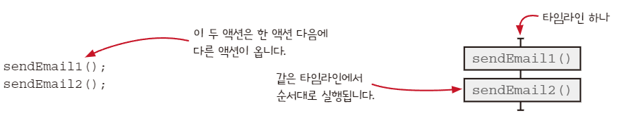
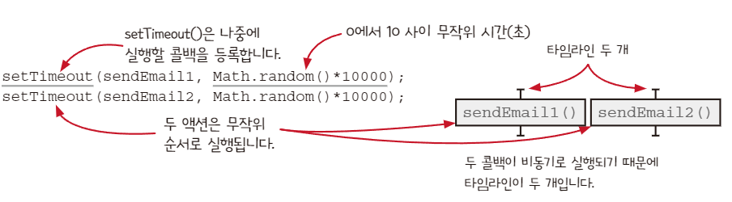

### 타임라인 격리하기

- 소프트웨어가 어떻게 동작하는지 이해하는 데 도움이 된다.

### 두 가지 타임라인 다이어그램 기본 규칙

1. 두 액션이 순서대로 나타나면 같은 타임라인에 넣습니다
    1. 
    
    
2. 두 액션이 동시에 실행되거나 순서를 예상할 수 없다면 분리된 타임라인에 넣습니다
    1. 
    
    

### 자세히 보면 놓칠 수 있는 액션 순서에 관한 두 가지 사실

1. ++와 +=는 사실 세 단계이다
    
    ```tsx
    total ++ // 단일 연산자지만 세 단계로 실행된다.
    
    let temp = total; // 읽기(액션)
    temp = temp + 1; // 더하기(계산)
    total = temp; // 쓰기 (액션)
    ```
    
2. 인자는 함수를 부르기 전에 실행한다
    
    ```tsx
    console.log(total) 
    
    //실행순서
    let temp = total;
    console.log(temp);
    
    /////// 예시 /////////
    function calculateSum(a, b) {
      return a + b;
    }
    
    let num1 = 5;
    let num2 = 10;
    let sum = calculateSum(num1 * 2, num2 + 5); // 인자가 먼저 평가됩니다.
    console.log(sum); // 25
    
    ```
    

### 타임라인 그리기 단계 1 : 액션을 확인하기

```tsx
function add_item_to_cart(name, price, quantity){
  cart = add_item(cart, name, price, quantity);
  //읽기         //읽기 
calc_cart_total();
}

function calc_cart_total(){
  total = 0;//쓰기
  cost_ajax(cart, function(cost){
  //부르기   //읽기  
    total += cost;
    //쓰기 
    shipping_ajax(cart, function(shipping){
    //부르기     //읽기
      total += shipping;
      // 읽기 쓰기 
      update_total_dom(total); 
      //부르기        //읽기
    })
  })
}
```

- 전역변수 읽고 쓰기, 비동기 콜백 등 존재

### 비동기 호출은 새로운 타임라인으로 그린다

### 한 단계씩 타임라인 만들기

- 콜백이 있는 것 등 점선으로 순서 표시를 하면서 타임라인을 단계적으로 그려 알아보기 쉽게 한다

### 타임라인 그리기 단계 2: 순서대로 실행되거나 동시에 실행되는 액션을 그린다

### 좋은 타임라인의 원칙

1. 타임라인은 적을수록 이해하기 쉽다
2. 타임라인은 짧을수록 이해하기 쉽다
3. 공유하는 자원이 적을수록 이해하기 쉽다
4. 자원을 공유한다면 서로 조율해야 한다
5. 시간을 일급으로 다룬다

### 타임라인 그리기 단계3: 플랫폼 정보를 사용해서 다이어그램을 단순화

### 정리

- 타임라인은 동시에 실행될 수 있는 순차적 액션을 말한다
    - 코드가 순서대로 실행되는지 동시에 실행되는지 알 수 있다