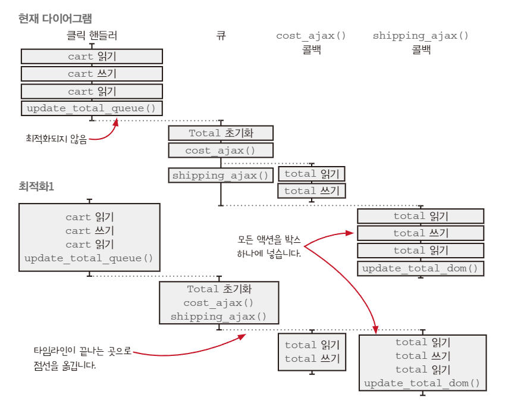

### 타임라인 조율하기

### 좋은 타임라인의 원칙

1. 타임라인은 적을수록 이해하기 쉽다
2. 타임라인은 짧을수록 이해하기 쉽다
3. 공유하는 자원이 적을수록 이해하기 쉽다
4. 자원을 공유한다면 서로 조율해야 한다
5. 시간을 일급으로 다룬다 
    1. 함수형 프로그래밍으로 문제에 맞는 `새로운 시간 모델` 을 만든다

### 액션을 확인하기: 단계 1

- 모든 액션을 확인하고 체크한다
- 과정은 476p부터 그림과 같이 살펴보는게 더 편리할 것이다

### 모든 액션을 그리기: 단계 2

### 다이어그램 단순화하기: 단계 3

- 자바스크립트 스레드 모델에서 단순화하기 위한 단계
    - 하나의 타임라인에 있는 `모든 액션을` 하나로 통합한다
    - 타임라인을 통합한다

### 암묵적 시간 모델 vs 명시적 시간 모델

- 간단한 프로그램에서는 암묵적 시간 모델이 좋다. 하지만 실행 방식을 바꾸지 못하기에
실행 방식에 가깝게 새로운 시간 모델을 비동기 콜백 사용 시 새로운 타임라인을 만들지 않도록 `큐를 만들었다`
- 여러 번 호출해도 한 번만 실행하는 액션을 만드는 과정도 존재