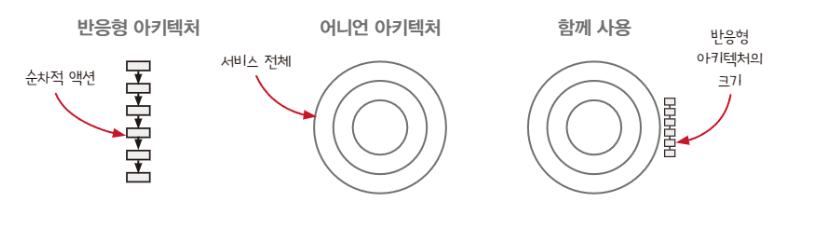
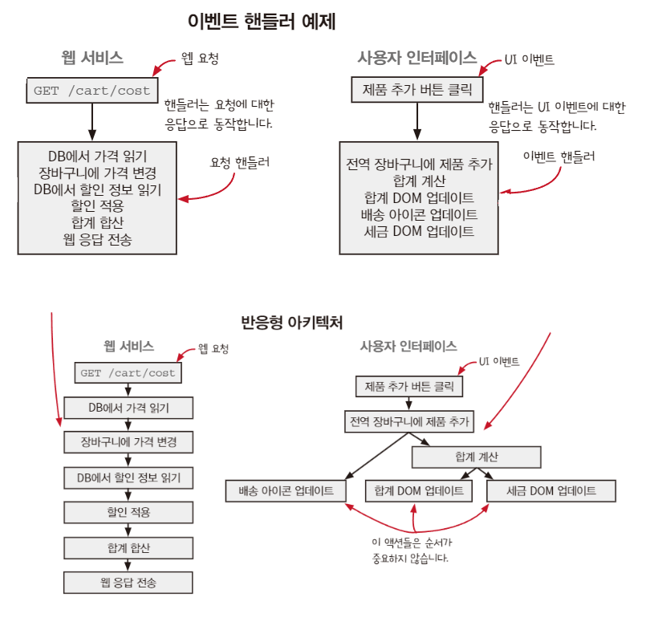
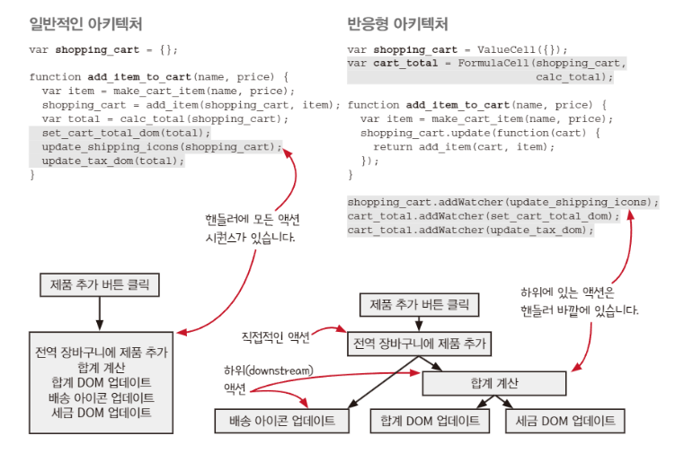
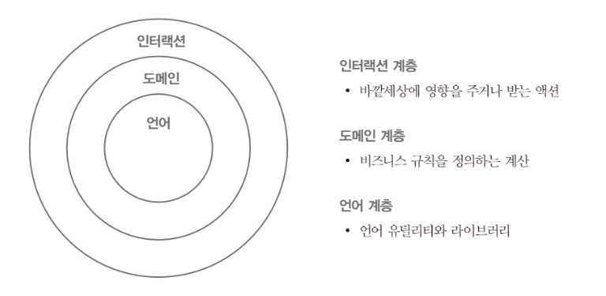

### 반응형 아키텍처와 어니언 아키텍처

- 반응형 아키텍처는 `순차적 액션 단계` 에 사용하고
- 어니언 아키텍처는 서비스의 `모든 단계` 에 사용한다


### 반응형 아키텍처

- 애플리케이션을 구조화하는 방법
- 핵심 원칙이 이벤트에 대한 반응으로 `일어날 일을 지정` 하는 것이다
- 웹 서비스와 UI에 잘 어울림. 이러한 모습이 `이벤트 핸들러` 로 표현한다




- 핸들러에 대한 내용을 여러 동작이 되지 않게끔 간소화하면 좋다

### 함수형 프로그래밍과 변경 가능한 상태

- 상태를 가능한 한 `안전하게` 사용하는 것이 중요하다

### 반응형 아키텍처가 시스템을 어떻게 바꿨나요

 

```tsx
반응형 아키텍처가 코드에 주는 3가지 영향

1. 원인과 효과가 결합된 것을 분리
2. 여러 단계를 파이프라인으로 처리
3. 타임라인이 유연해진다 
```

- 원인과 효과에 대한 예시
    - `버튼 클릭` 이라는 원인과 그로 인해 발생하는 배송 아이콘 `갱신` 이라는 효과가 결합
    - 이를 분리하여 어떤 원인에 의해 장바구니가 변경되더라도 배송 아이콘을 갱신한다
    - 즉, 원인과 효과를 분리해서 여러 군데에서 사용되도록 진행하는 것 같다


### 어니언 아키텍처란?



1. 현실 세계와 상호작용은 인터랙션 계층에서 해야 한다
2. 계층에서 호출하는 방향은 중심 방향
3. 계층은 외부에 어떤 계층이 있는지 모른다

### 변경과 재사용이 쉬워야 한다

### 도메인 규칙은 도메인 용어를 사용한다

- 제품(product), 이미지(image), 가격(price)와 같은 용어를 도메인 규칙에서 사용한다
- 데이터 베이스는 도메인을 나타내는 용어가 아니다