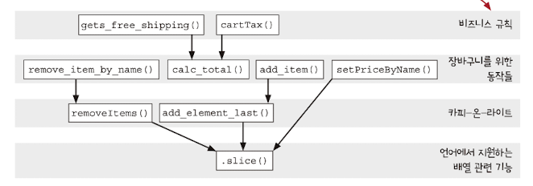
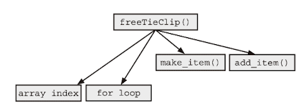
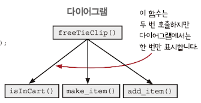
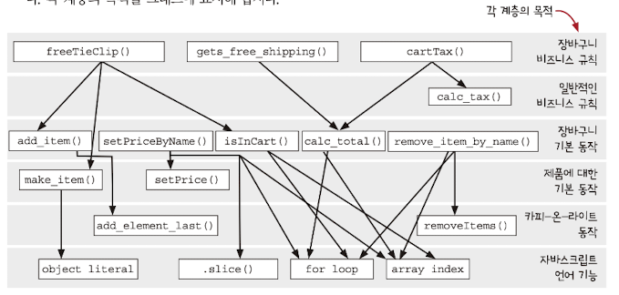

## 계층형 설계 - I

### 소프트웨어 설계란?

- 코드를 만들고, 테스트하고, 유지보수하기 쉬운 프로그래밍 방법을 선택하기 위해 미적 감각(?)을 사용하는 것

### 계층형 설계란?



- 계층형 설계는 소프트웨어를 `계층` 으로 구성하는 기술이다. 다만, 정확하게 구분하는 어렵기에 이를 잘 구분하기 위해서 다양한 변수를 찾고, 이러한 변수들을 어떻게 해야 하는지 파악해야 한다

### 계층형 설계 패턴

패턴 1 : 직접 구현에서만 현재 챕터에서 다루고 나머지는 이후 챕터에서 다룬다

- 패턴 1 : 직접 구현
    - 직접 구현된 함수를 읽고 함수 본문에서 적절한 구체화 수준을 본다
- 패턴 2 : 추상화 벽
    - 어떤 계층은 중요한 세부 구현을 감추고 인터페이스를 제공한다. 그렇기에 추상화 단계만 생각하여 두뇌 용량의 한계를 극복한다 → 복잡하게 생각 안한다는 의미인듯(너무 딥하게)
- 패턴 3 : 작은 인터페이스
    - 시스템이 커질수록 비즈니스 개념을 나타내는 중요한 인터페이스는 최소한으로 유지하여 정의한다
- 패턴 4 : 편리한 계층
    - 코드와 코드가 속한 추상화 계층은 작업할 때 편하도록 즉, 개발자의 요구를 만족하고 비즈니스 문제를 잘 풀도록 계층을 만들어야 한다.

### 패턴 1: 직접 구현

- 넥타이 클립을 무료로 주는 함수에서 제품이 있는지 확인하는 반복문 즉, `저수준의 코드` 를 추출해서 사용하는 방법이 개선점으로 보인다
- 또한, 해당 함수가 cart가 배열이라는 것을 의미 상 알 필요가 없다. 오프-바이-원 문제점도 발생할 수 있기 때문이다
    - 오프-바이-원(off-by-one) : 주로 배열을 반복해서 처리할 때 크다 혹은 크거나 같다와 같이 비교문을 잘못 선택해 의도하지 않게 마지막 항목을 처리하지 못하거나 처리하는 오류를 의미

```tsx
function freeTieClip(cart) {
	var hasTie = false
	var hasTieClip = false
	
	for (var i = 0; i < cart.length; i++) {
		var item = cart[i]
		if (item.name === 'tie') hasTie = true
		if (item.name === 'tie clip') hasTieClip = true
	}
	
	if (hasTie && !hasTieClip) {
		var tieClip = make_item('tie clip', 0)
		return add_item(cart, tieClip)
	}
	return cart
}
```

- 위의 과정을 `호출 그래프` 로 표현해보자



- make_item과 add_item은 `직접 만든` 함수이다. 이들은 모두 같은 추상화 수준이 아니다
- array index와 for loop은 `언어 기능` 의 추상화이며 더 낮은 추상화 단계이기에 위와 같이 표현되었다.

- 즉, 위의 호출 그래프를 보았을 때 `한 함수` 에서 서로 다른 추상화 단계를 사용하면 코드가 명확하지 않아 읽기 어려운 문제가 있다
- 서로 다른 추상화 단계에 있는 기능을 사용하면 `직접 구현 패턴이 아니다`

**직접 구현 패턴으로 수정된 코드 및 다이어그램**

```tsx
function freeTieClip(cart) {
	var hasTie = isInCart(cart, 'tie')
	var hasTieClip = isInCart(cart, 'tie clip')

	
	if (hasTie && !hasTieClip) {
		var tieClip = make_item('tie clip', 0)
		return add_item(cart, tieClip)
	}
	return cart
}

function isInCart(cart, name) {
	for (var i = 0; i < cart.length; i++) {
		if (cart[i].name === name) return true
	}
	return false
}

```



- freeTieClip함수 내에서 장바구니가 배열로 되어있는 것을 알 필요가 없듯이 같은 추상화 수준으로 함수를 만들어서 비슷하게 구현하였다

- 우리가 호출 그래프를 만든다고 했을 때 책에서처럼 정해져 있는 모습이 없다
- 각 사람마다 분류나 생각하는게 다르기 때문에 어떤게 맞고 틀린 것이 있는게 아닌 서로가 토의하고 정하는 방법이 맞다


### 같은 계층에 있는 함수는 같은 목적을 가져야 한다



- 위와 같이 다이어그램으로 만들면 계층 별로 나누기 때문에 패턴을 살펴보기 편하다

### 3단계 줌 레벨

- 다이어그램에서도 문제를 찾을 수 있는데 세 가지 다른 영역에서 찾을 수 있다

```tsx
1. 계층 사이에 상호 관계
2. 특정 계층의 구현
3. 특정 함수의 구현
```

1. 전역 줌 레벨
    - 기본 줌 레벨이며 `계층 사이에 상호 관계` 를 포함하여 모든 영역 문제를 살펴볼 수 있다
2. 계층 줌 레벨
    - 한 계층`(특정 계층)`과 연결된 바로 아래 계층을 볼 수 있는 레벨
3. 함수 줌 레벨
    - 함수 하나`(특정 함수)`와 바로 아래 연결된 함수들을 볼 수 있다

### 정리

- 연습문제들에서 보면 함수에 대해 다이어그램에서 직접 구현 패턴처럼 만들기 위해 화살표의 수를 줄이고 같은 계층에 있도록 만드려고 한다.
- 하지만, 그럴 경우에 오히려 복잡하게 보이는 경우도 있다.
- 그렇기에 설게가 가장 어려운 점으로도 보인다.
- 이처럼 좋은 설계가 되기 위해서 `지속적인 탐구와 직관` 이 필요하다고 책에서는 말하고, 나 또한 동의한다